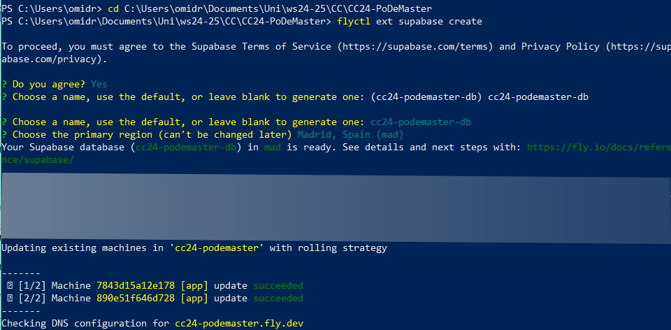
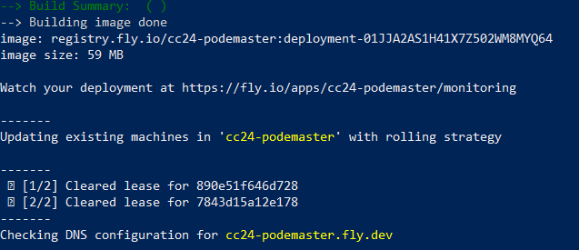
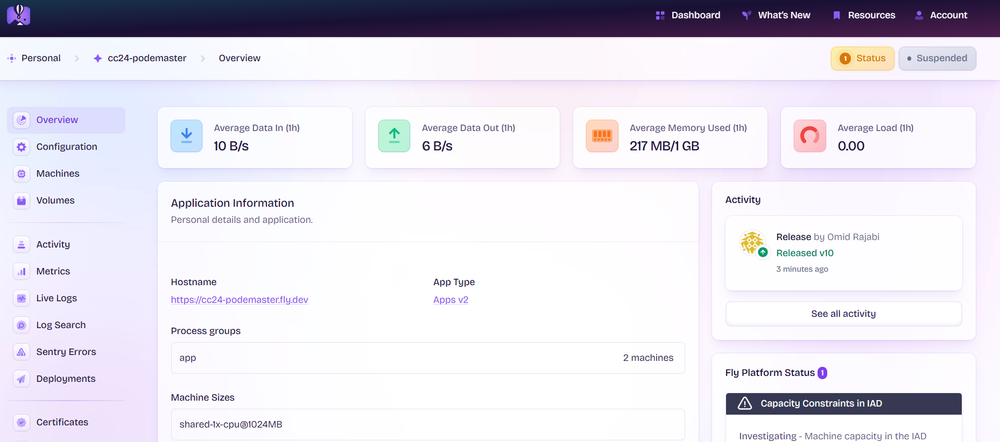
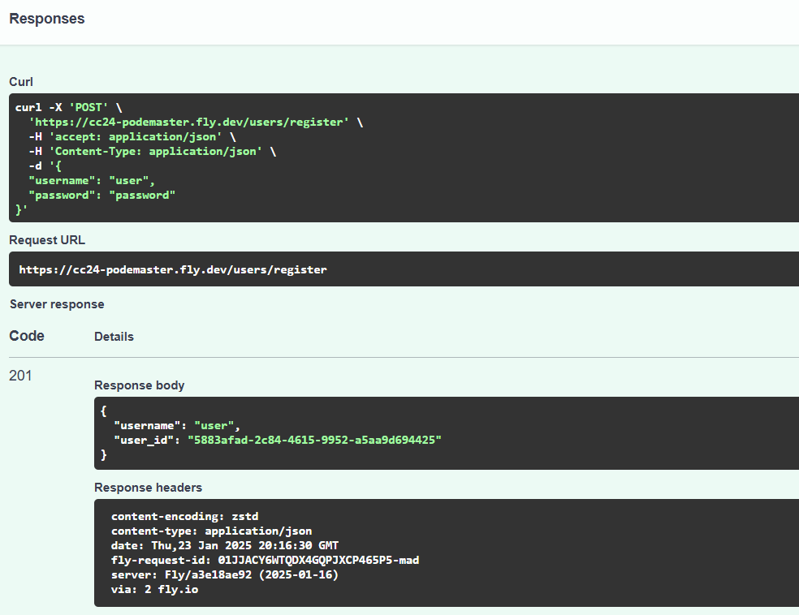
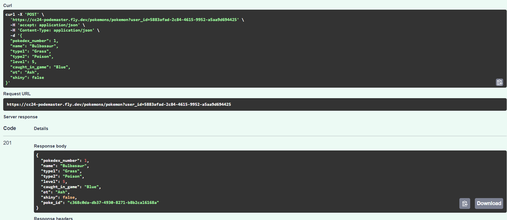

# Hito 5 - PoDeMaster PaaS Deployment

## Overview
In this milestone we deployed our PoDeMaster Application with the help of the PaaS platform Fly.io. 


## Why Fly.io?
We chose Fly.io as our platform-as-aservice. As mentioned before it offers an easy and efficient way to deploy applications with minimal configuration and without great effort. Furthermore it offers Docker support and easy continous deployment integration with GitHub Actions. Additionally it is possible to connect a free Database (Supabase) to our project without paying more.
Other reasons include the built-in scalability, the automatic load balancing, and the possiblity to deploy the application close to our users. 


## Deployment
### Install Fly CLI
Fly provides an easy-to-use CLI tool for deployment. We need to install it by using:
```bash
curl -L https://fly.io/install.sh | sh
```
After installation, we can verify it by running:
```bash
flyctl --version
```

### Create Fly Account and Launching
Next we need to create a Fly Account. We connected it to our GitHub Account which will give us a 7-day trial. Another beneift of connecting it to our GitHub Account is that it will enable us to choose the repository which we want to deploy. 
After selecting our PoDeMaster repository it initialize and deploys the application on its own (see image below). With this initialization it also creates all the necessary files needed (fly.toml). 
We used this approach and everything worked fine. 
We adjusted the ``fly.toml`` file to include our Dockerfile.  

### Launching Alternatively 
Alternatively we can we can navigate to our project directory after authorization and run:
```bash
flyctl launch
```
This command will:
- Create a `fly.toml` configuration file
- Detect the application type
- Deploy a default version of your app


### Adding Supabase
Next we needed to add Supabase as our Database and choose a name for it. 
```bash
flyctl ext supabase create
```



### Generate Authentification Token
Next we need to generate a fly auth token by using the following command: 
```bash
flyctl tokens create 
```
We will save this token as a secret in our repository under ``FLY_API_TOKEN``.


### Deploying
Since we made some changes we need to deploy our application another time. We use the following command: 
```bash
flyctl deploy
```



## Set Up GitHub Actions
To automate deployment, we created a `.github/workflows/deploy.yml` file with the following content:
```
name: Deploy to Fly.io
on:
  push:
    branches:
      - main
jobs:
  deploy:
    name: Deploy app
    runs-on: ubuntu-latest
    concurrency: deploy-group
    steps:
      - uses: actions/checkout@v4
      - uses: superfly/flyctl-actions/setup-flyctl@master
      - run: flyctl deploy --remote-only
        env:
          FLY_API_TOKEN: ${{ secrets.FLY_API_TOKEN }}
```
Important to note is that we included our generated ``FLY_API_TOKEN``. 

### Checking our Application
Our application can be reached with the following link: https://cc24-podemaster.fly.dev/

For interactive documentation and testing one can use the following link: https://cc24-podemaster.fly.dev/docs

Fly.io offers us a Dashboard to monitor our application. We can see in the image below how everything is working, how machines are used, as well as metrics such as data usage etc.


## Testing 
We used the https://cc24-podemaster.fly.dev/docs to test our application. 
With this it is possible to test all of our use cases. Below we see some screenshots. 

We can register a new user. When registering a new User we get a User ID which is necessary for all further operations. 


Next we tested the adding of a Pokémon. Here we need to add the previously mentioned User ID. 



