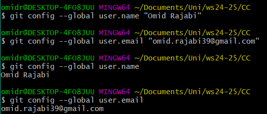
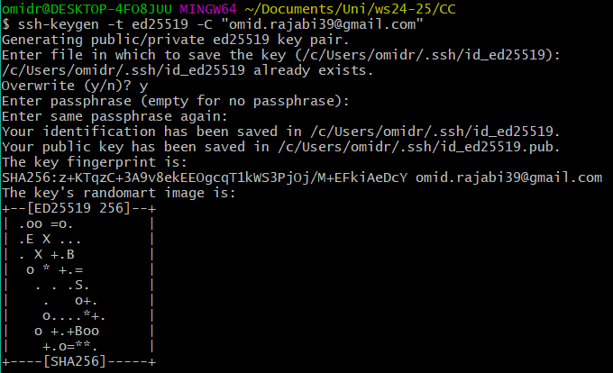
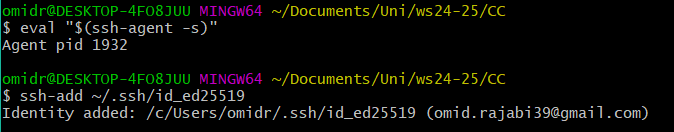
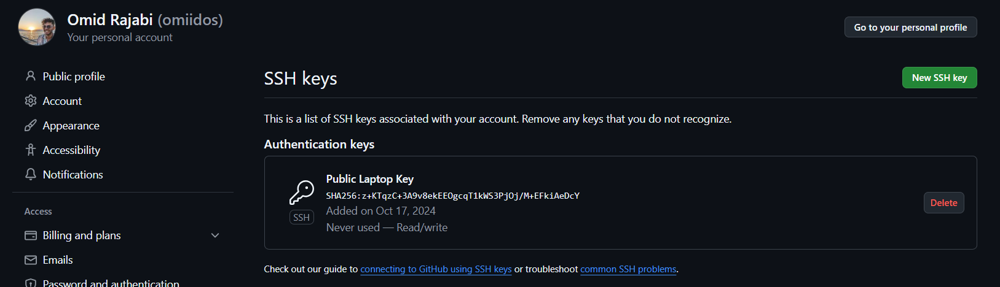
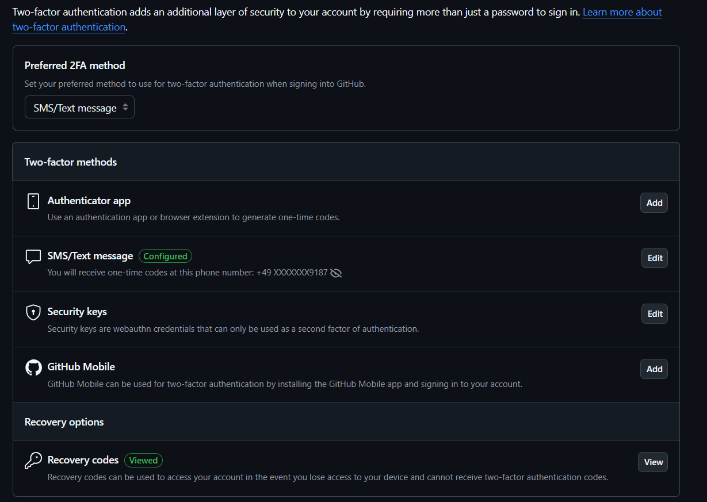

# PoDeMaster -- Cloud Computing Project 
*Hito 1 -- Cloud Computing Project by Omid Rajabi*

*Version 1.0*

This image was generated by Microsoft Copilot.

### Git Configuration
**Config of name and email in Git**
We have to execute the following commands in gitbash / cmd /.. in order to have our name and email associated with future commits we make. With the last two commands we can check if our changes worked. 

**Generation of public/private key pair**
In order to generate a public/private SSH key pair we have to execute the following command. It uses the ed25519 algorithm to generate the keys. If your system does not support the ed25519 algorithm, you can use RSA instead. 
Once executed, it will ask you where you want to save the keys (I chose the default option). It will also ask you for a passphrase to make the key more secure. As a result we will get the following.

**Add SSH Key to SSH Agent**
After generating the key, we need to add it to the SSH agent to manage your keys. Therefore we need to execute the following commands.

**Add Public Key to github**
Now we need to add the generated keys to our github account.

**Test**
To verify that everything is set up correctly, we can run the following command. If correct, it should greet us with the message below.

**Two-Factor-Authentication**
In order to enable 2FA we have to go to the settings of our github account and go the option “Password and authentication”. 
In the section “Two-factor authentication” we can click the button “Enable two-factor authentication”. 
You can choose if you want to do it with a authentication app like google Authenticator or if you want to do it via your phone number. 
I chose authentication via text message.

